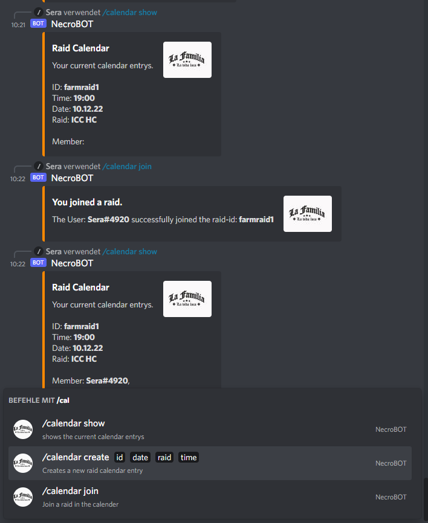
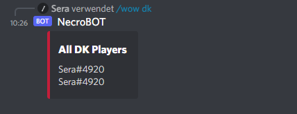
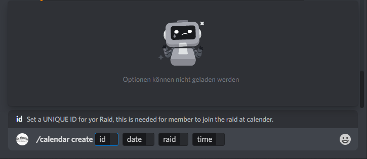

# Discord Bot with Python & Hikari #

## Description ##

This discordbot is planned to be a musicstreambot aswell chatmoderation and some other that i currently not thinking off.
All Plugins are modular and not required to load all of them to work propertly.

## Status ##

This project is still under development and not save to be use in production mode.
Musicbot, Chatmoderation and interactive role selection is now implemented.
Feel free to edit.

### Features ###

This features are planned. This list would be edit. If you would like request a feature just open a new [Issue](https://github.com/sera619/DiscordBot-python-hikari/issues).

|Feature|Implemented|
|:--------|---------:|
|Musicbot| ✅|
|Chatmoderation| ✅|
|Modular Plugin-System|❌ / ✅|
|Usercommands|❌ / ✅|
|Admincommands|❌ / ✅|
|Interactive Role Selection|✅|
|World of Warcraft Class/Role List|✅|
|Interactive Calender|✅|

## Requirements/Installation ##

You will need the follow software installed on your system to run this:

>*You can click the links to get the packages on pypi.org*
>
> - Download or clone the whole project.
> - Python version 3.9.x or higher
> - Python package ['Hikari'](https://pypi.org/project/hikari/)
>
>   ```cmd
>   pip install hikari
>   ```
>
> - Python package ['Hikari-Miru'](https://pypi.org/project/hikari-miru/)
>
>   ```cmd
>   pip install hikari-miru
>   ```
>
> - Python package ['Hikari-Lightbulb'](https://pypi.org/project/hikari-lightbulb/)
>
>   ```cmd
>   pip install hikari-lightbulb
>   ```
>
> - Python package ['Lavasnek-rs'](https://pypi.org/project/lavasnek-rs/0.1.0-alpha.0/)
>
>   ```cmd
>   pip install lavasnek-rs==0.1.0-alpha.0
>   ```
>
> - For the music plugin in you need the ['Lavalink Server'](https://dsharpplus.github.io/articles/audio/lavalink/setup.html). Follow the installation steps __and save the server in a dictionary called 'lavalink' in the root directory of this bot__
>
> - Create a '.env' File in 'plugins' directory with the follow variables:
>   - TOKEN='Your DiscordToken'
>   - SERA_DISCORD_ID= 'YOUR DISCORD GUILD/CHANNAL ID'
>   - SERA_ID='YOUR DISOCRD USER ID'
>   - LAVALINK_SERVER=127.0.0.1
>   - LAVALINK_PORT=2333
>   - LAVALINK_PASSWORD=kekskeks
>
> - If the bot is already joined your discord you have to use '/admin init' __notice: you require adminpermission on the discordserver to use the command__

### Please notice that u need your own token for your application ###

### Sorry that i dont give instruction here but it exists so many tutorials for this im sure you will find the solution quickly ###

### Screenshots ###

> 
> 
> 
> 
> 
> 
> 
> 
>
